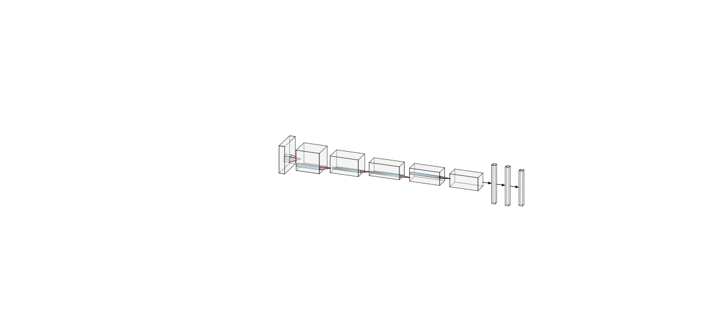

# Hand-Gesture-Recognition

### About
Detect hand gesture using webcam. Design neural network (Convolution Neural Network) from scratch using Tensorflow.

### Project Structure 
. 
├── **data**:- contains training data 
├── **gesture**:- contains all the scripts 
&emspg;&emsp;├── **builder.py**:- create custom image dataset using webcam 
&emsp;&emsp;├── **helper.py**:-  load and read the dataset for training 
&emsp;&emsp;├── **model.py**:-  train & validate the model on the  train dataset  
&emsp;&emsp;├── **evaluate.py**:- test/evaluate the model on the unknown/test dataset 
&emsp;&emsp;├── **gesture.py**:- live detection using hand gesture 
├── **model**:- contains the trained model  
├── **output**:- contains images.

### Models Overview
Its is a 5 layers convolution neural network with 2 fully connected network.
max-pooling is done on every convolution layer in this case 5 layers

**Data parameter** 
images dimensions are 64*64

###  Environment Dependencies
1. Tensorflow 1.3
2. Numpy
3. OpenCV

### Resources

https://course17.fast.ai/lessons/lesson4.html
